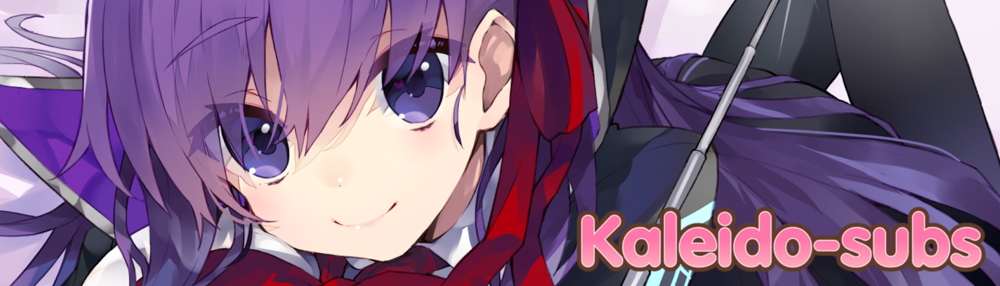

<!-- TO-DO: Figure out why <styl> tags don't work -->

    </img>

<h2 align="center">Connect with us!</h2>

Kaleido is a fansub group aimed at high-quality translation and localisation, alongside high video and typesetting
quality, no matter how long it may take.

Kaleido operates primarily through a freelancer-style system. We have our core members, but also employ other fansubbers
all over to collaborate with us on projects. This opens the doors to both veteren and green fansubbers to try their
hands at projects and create some fansubs.

We're also very open to collaborations and open-source fansubbing projects! All our finalised releases will be publicly
available in this organisation, and you are free to create your own copies to build upon them as you'd like. Full
credit is not required, but we would appreciate it!

As these repositories are public, you can leave Issues and Pull Requests to let us know about any problems in our

Want to work with Kaleido? We can try to work something out! Contact us through <a href=https://discord.gg/dk7aadV target="_blank">Discord</a>,
and if there is staff interest, we can continue talks and see what sprouts out of it!

    

<!--START_SECTION:activity-->

<!-- TODO: Make deschtimes progress visible here? -->

<h2 align="center"> Frequently Asked Questions</h2>

How do I build your subtitles?

    - lorem ipsum

Can I translate your translation into another language?

    - lorem ipsum

